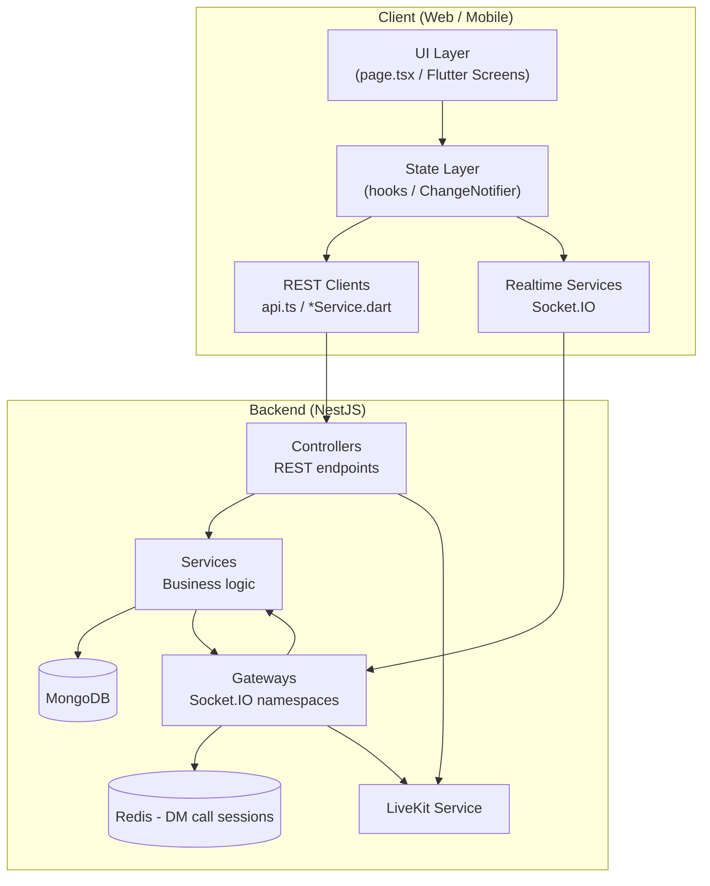
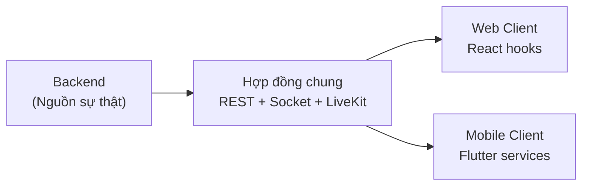

# Cordigram — Tài liệu tổng hợp tính năng Messages (Web + Mobile + Backend)

> **Mục đích:** Tài liệu thuyết trình bảo vệ đồ án — mô tả toàn bộ tính năng Messages từ lớn đến nhỏ, cách hoạt động, các function/luồng chính và phần nào được **kế thừa / dùng chung** giữa 3 tầng.

---

## Mục lục

1. [Tổng quan kiến trúc](#1-tổng-quan-kiến-trúc)
2. [Sơ đồ tầng và luồng dữ liệu](#2-sơ-đồ-tầng-và-luồng-dữ-liệu)
3. [Danh sách tính năng từ lớn đến nhỏ](#3-danh-sách-tính-năng-từ-lớn-đến-nhỏ)
4. [Backend — Module, API, Realtime](#4-backend--module-api-realtime)
5. [Web — Trang, Hook, Component](#5-web--trang-hook-component)
6. [Mobile — Màn hình, Controller, Service](#6-mobile--màn-hình-controller-service)
7. [Kế thừa & hợp đồng dùng chung](#7-kế-thừa--hợp-đồng-dùng-chung)
8. [Luồng hoạt động chi tiết (cho slide thuyết trình)](#8-luồng-hoạt-động-chi-tiết-cho-slide-thuyết-trình)
9. [Điểm khác biệt Web vs Mobile](#9-điểm-khác-biệt-web-vs-mobile)
10. [Gợi ý cấu trúc slide bảo vệ](#10-gợi-ý-cấu-trúc-slide-bảo-vệ)

---

## 1. Tổng quan kiến trúc

Messages là **hệ thống nhắn tin đa nền tảng** kiểu Discord + Messenger, gồm:

| Tầng | Công nghệ | Vai trò |
|------|-----------|---------|
| **Backend** | NestJS + MongoDB + Socket.IO + LiveKit + Redis | Lưu trữ, xử lý nghiệp vụ, realtime, gọi thoại/video |
| **Web** | Next.js (React) + Socket.IO client + LiveKit | Giao diện desktop/browser, trang `/messages` monolith |
| **Mobile** | Flutter + Socket.IO + LiveKit | Ứng dụng iOS/Android, module `lib/features/messages` |

### Nguyên tắc thiết kế chung

- **REST** cho thao tác bền vững (tải lịch sử, tạo/sửa/xóa, cài đặt).
- **WebSocket (Socket.IO)** cho sự kiện thời gian thực (tin mới, typing, presence, gọi, reaction).
- **LiveKit** cho media realtime (gọi DM 1:1, voice channel nhiều người).
- **Hồ sơ Messages tách biệt** khỏi hồ sơ Social (`messaging-profiles` ≠ `profiles`).

---

## 2. Sơ đồ tầng và luồng dữ liệu



### Ba namespace Socket.IO chính

| Namespace | Dùng cho |
|-----------|----------|
| `/direct-messages` | DM: tin nhắn, typing, read, presence, gọi 1:1, style profile |
| `/channel-messages` | Kênh server: tin mới, reaction, join/leave room, thông báo @mention |
| `/notifications` | Thông báo chung, FCM push, force logout |

---

## 3. Danh sách tính năng từ lớn đến nhỏ

### Cấp 1 — Nền tảng Messages (Shell)

| Tính năng | Mô tả ngắn |
|-----------|------------|
| **Messages Shell** | Khung giao diện 3 cột (web) / nested navigator (mobile) |
| **Chuyển ngữ cảnh DM ↔ Server** | Home DM (danh sách bạn bè) ↔ chọn server ↔ Explore |
| **Cài đặt người dùng Messages** | 6 mục: Chung, Riêng tư, Tin nhắn, Giao diện, Thông báo, Hồ sơ |
| **Giao diện / Theme** | Dark / Light / Galaxy, accent color, chrome tuỳ chỉnh |
| **Inbox tổng hợp** | For You, Unread, Mentions |
| **Tìm kiếm tin nhắn** | Global DM + theo kênh/DM, cú pháp `from:`, `@`, `#`, `has:` |
| **Messages Boost** | Stripe checkout, giới hạn upload, sticker, kiểu tên hiển thị |

**Web:** `app/(main)/messages/page.tsx` (~14k dòng, orchestrator chính)  
**Mobile:** `MessagesShell` → `MessageHomeScreen`  
**Backend:** `inbox`, `boost`, `payments`, `users` (settings)

---

### Cấp 2 — Direct Messages (DM 1:1)

| Tính năng | REST / Socket | Ghi chú |
|-----------|---------------|---------|
| Danh sách hội thoại + unread | `GET /direct-messages/conversations`, socket `dm-unread-count` | Sắp xếp theo hoạt động |
| Gửi/nhận tin realtime | `POST /direct-messages/:receiverId`, socket `send-message` / `new-message` | Optimistic UI trên client |
| Text, ảnh, video, GIF, sticker | REST + upload `/posts/upload` | Giphy proxy |
| Voice message | Upload + `type: voice` | Player riêng |
| Typing indicator | socket `typing` / `user-typing` | |
| Read receipts | `POST .../read`, socket `mark-as-read`, `messages-read` | |
| Presence (online/idle/offline) | socket `presence-subscribe`, `presence-updated` | Tôn trọng `sharePresence` |
| Reply, reaction, pin | REST + socket `reaction-added` | |
| Xóa (for-me / for-everyone) | REST + socket `message-deleted` | |
| Báo cáo tin nhắn | Service layer (backend có schema, route hạn chế) | |
| Poll trong DM | `POST /polls` | Dùng chung module polls |
| Thẻ mời server trong DM | `server-invites` | |
| Hồ sơ DM (avatar, bio, kiểu tên) | `GET/PATCH /messaging-profiles/me` | Tách social profile |
| Chặn / mute hội thoại | User settings + local prefs | |
| Lọc sidebar DM | `everyone` / `followers_only`, online-only | |

**Web hook:** `hooks/use-direct-messages.ts`  
**Mobile:** `MessagesController` + `DirectMessagesService` + `DirectMessagesRealtimeService`  
**Backend:** `src/direct-messages/`

---

### Cấp 3 — Gọi thoại / video DM (1:1)

| Bước | Cơ chế |
|------|---------|
| Bắt đầu cuộc gọi | socket `call-initiate` + `POST /calls/create` (LiveKit token) |
| Nhận cuộc gọi | socket `call-incoming` → popup / overlay |
| Trả lời / từ chối | socket `call-answer` / `call-reject` |
| Media | LiveKit room `dm-{sortedUserIds}` |
| Kết thúc | socket `call-end` → tạo tin `type: call` trong lịch sử |
| Busy / multi-tab | `DmCallSessionService` (Redis), `call-busy`, `call-sessions-sync` |
| Push khi offline | FCM qua `NotificationsGateway` | |

**Web:** `/call` tab riêng + `CallRoom.tsx`, `GlobalDmIncomingCalls`  
**Mobile:** `DmCallManager` + `NativeCallScreen` + `GlobalCallOverlay`  
**Backend:** `direct-messages.gateway`, `call/`, `dm-call/`, `livekit/`

---

### Cấp 4 — Servers & Channels (Discord-style)

| Tính năng | API chính |
|-----------|-----------|
| Tạo / tham gia / rời server | `POST/GET /servers`, `join`, `leave` |
| Explore server công khai | `GET /servers/explore` |
| Category + text/voice channel | `/servers/:id/channels/*` |
| Sắp xếp kéo thả category/channel | `PATCH .../reorder/*` |
| Tin nhắn kênh text | `POST/GET /channels/:channelId/messages` |
| Realtime kênh | socket `join-channel` → `new-message` | Phải join room trước |
| @mention + autocomplete | `GET /servers/:id/mentions` | |
| Emoji / sticker tuỳ chỉnh server | `/servers/:id/emojis`, `/stickers` | Boost-gated |
| Link preview | `GET /link-preview?url=` | |
| Wave sticker (welcome) | `POST .../wave-sticker` | |
| Poll trong kênh | `POST /polls` + quyền `createPolls` | |
| Sidebar prefs (ẩn/mute kênh) | LocalStorage / SharedPreferences key `cordigram_sidebar_prefs_v1` | **Kế thừa key cross-platform** |
| Server events | `/servers/:serverId/events` | |
| Mời vào server | `/server-invites` | |

**Web:** `lib/servers-api.ts` + `use-channel-messages.ts`  
**Mobile:** `ServersService`, `ChannelMessagesService`, `ChannelMessagesRealtimeService`  
**Backend:** `servers/`, `channels/`, `messages/`, `events/`, `server-invites/`

---

### Cấp 5 — Voice Channel (LiveKit đa người)

| Bước | Chi tiết |
|------|----------|
| Room name | `voice-{serverId}-{channelId}` |
| Token | `POST /livekit/token` |
| Danh sách participant | `GET /livekit/voice-channel-participants` |
| Giới hạn | Tối đa 15 người/phòng |
| UI | Grid participant, mic/deafen, screen share (web đầy đủ hơn mobile) |

**Web:** `VoiceChannelCall.tsx` nhúng trong chat area  
**Mobile:** `VoiceChannelRoomScreen` + `VoiceChannelSessionController` + PiP overlay

---

### Cấp 6 — Kiểm soát truy cập & Join flow

| Gate | Mô tả |
|------|-------|
| Rules channel | Đọc quy tắc trước khi chat |
| Age restriction | Xác minh tuổi |
| Email OTP | Xác minh email |
| Apply-to-join | Form + admin duyệt |
| Timeout member | Moderation action |

**Backend:** `access/` + `ServerAccessService`  
**Mobile:** `ServerJoinFlow`, `ChannelChatGateSheet`  
**Web:** modals/rules trong `page.tsx`

---

### Cấp 7 — Quản trị Server (Server Settings)

| Mục | Chức năng |
|-----|-----------|
| **Hồ sơ server** | Tên, icon, banner |
| **Tương tác** | Welcome message, mức thông báo mặc định |
| **Emoji / Sticker** | Upload, quản lý, boost tier sticker |
| **Thành viên** | Kick, ban, timeout, prune, chuyển ownership |
| **Vai trò (Roles)** | Permission text/voice channel, moderation |
| **Truy cập (Access)** | Join gates, rules, applications |
| **An toàn (Safety)** | Spam, content filter |
| **Chặn (Bans)** | Danh sách ban/unban |
| **AutoMod** | Từ cấm, mention spam — **enforce lúc gửi tin kênh** |
| **Cộng đồng (Community)** | Discovery, onboarding |
| **Xóa server** | Danger zone (owner) |

> **Lưu ý:** Nhật ký chỉnh sửa (Audit log) có API backend + màn mobile riêng nhưng **đã ẩn khỏi hub mobile**; web cũng hạn chế hiển thị.

**Web:** `ServerSettingsPanel/` + sections  
**Mobile:** `ServerSettingsHubScreen` → các màn con trong `server_settings/`  
**Backend:** `servers.controller`, `roles/`, `audit-log/`

---

### Cấp 8 — Hồ sơ & tuỳ biến hiển thị

| Tính năng | Field / API |
|-----------|-------------|
| Hồ sơ Messages chính | `displayName`, `chatUsername`, `bio`, `pronouns`, `avatarUrl`, `coverUrl` |
| Kiểu tên hiển thị (Boost) | `displayNameFontId`, `displayNameEffectId`, `displayNamePrimaryHex`, `displayNameAccentHex` |
| Hồ sơ theo server | `PATCH /servers/:id/me/profile`, nickname, avatar server |
| Preview realtime | Web: CustomEvent `cordigram-user-profile-style-updated`; Mobile: `emitLocalProfileStyleUpdated` |
| Presence privacy | `sharePresence` trong user settings |

**Web:** `MessagesProfileEditor.tsx`, `DisplayNameStyleModal.tsx`  
**Mobile:** `MessagesProfileEditor`, `DisplayNameStyleSheet`, `DisplayNameStyledText`  
**Backend:** `messaging-profiles/`, `UserServer` schema

---

### Cấp 9 — Tiện ích chat nhỏ

| Tiện ích | Web | Mobile |
|----------|-----|--------|
| Composer (emoji, GIF, sticker, voice record) | Inline composer | `ChatComposerBar`, `ChatExpressionsMenu` |
| Link preview card | `LinkPreviewCard` | `LinkPreviewCard` widget |
| Media viewer | `ChatMediaViewer` | `ChatMediaViewer` |
| Pinned messages | Panel + REST | `PinnedMessagesScreen` |
| Conversation details | `ConversationDetailsPanel` | `ConversationDetailsSheet` |
| Reaction picker | `MessageReactions` | Inline trong chat screens |
| Notification sound | `message-notification-sound.ts` | `MessageNotificationSound` |
| Call history card | `CallMessageCard` | `DmCallMessageCard` |

---

## 4. Backend — Module, API, Realtime

### 4.1. Cây module chính

```
cordigram-backend/src/
├── direct-messages/      # DM REST + gateway + presence + call signaling
├── messages/             # Channel messages REST + gateway + automod enforce
├── messaging-profiles/   # Hồ sơ chat (tách social)
├── servers/              # Server CRUD, moderation, safety, emoji/sticker
├── channels/             # Category + text/voice channel
├── roles/                # Permission roles
├── access/               # Join gates, UserServer membership
├── server-invites/       # Mời server qua DM
├── inbox/                # For-you feed + unread rollup
├── call/ + dm-call/      # REST call + session Redis
├── livekit/              # Token + room naming
├── boost/                # Entitlements Messages Boost
├── events/               # Server scheduled events
├── search/               # Unified message search
├── link-preview/         # OG metadata
├── polls/                # Polls (DM + channel)
├── notifications/        # WS notifications + FCM
└── audit-log/            # Lịch sử thay đổi server settings
```

### 4.2. Phụ thuộc giữa module (kế thừa / inject)

- **Automod không phải module riêng** — cấu hình nằm trong `Server.safetySettings`, được `MessagesService.createMessage()` kiểm tra khi gửi tin kênh.
- **Presence không lưu DB riêng** — map in-memory trong `DirectMessagesGateway`; `sharePresence` mask qua `UsersService` + gateway.
- **Circular dependency** giữa `ServersModule` ↔ `RolesModule` ↔ `MessagesModule` ↔ `BoostModule` — giải quyết bằng `forwardRef()` và `ModuleRef.get()`.
- **`DmCallModule` @Global()** — inject session service vào gateway mà không import trực tiếp.

### 4.3. Schema MongoDB quan trọng

| Collection | File | Nội dung chính |
|------------|------|----------------|
| DirectMessage | `direct-message.schema.ts` | sender/receiver, type, reactions, call log, voice |
| Message | `message.schema.ts` | channelId, mentions, moderation result |
| MessagingProfile | `messaging-profile.schema.ts` | chat identity + display name style |
| Server | `server.schema.ts` | members, safetySettings, stickers |
| Channel | `channel.schema.ts` | text/voice, category, private |
| Role | `role.schema.ts` | permissions |
| UserServer | `user-server.schema.ts` | join state, per-server profile/style |
| ChannelReadState | `channel-read-state.schema.ts` | last read per user/channel |

### 4.4. REST endpoints tiêu biểu

**DM:**
- `POST /direct-messages/:receiverId` — gửi tin
- `GET /direct-messages/conversation/:userId` — lịch sử
- `GET /direct-messages/conversations` — danh sách hội thoại
- `POST /direct-messages/conversation/:userId/read` — đánh dấu đã đọc

**Kênh:**
- `POST /channels/:channelId/messages` — gửi (chạy automod + moderation)
- `GET /channels/:channelId/messages` — tải tin
- `POST /channels/:channelId/messages/read` — đọc kênh

**Hồ sơ Messages:**
- `GET/PATCH /messaging-profiles/me`
- `POST /messaging-profiles/avatar/upload`

**Gọi / Voice:**
- `POST /calls/create`, `POST /calls/join`
- `POST /livekit/token`
- `GET /livekit/voice-channel-participants`

**Inbox:**
- `GET /inbox/for-you`, `/unread`, `/mentions`
- `POST /inbox/seen`

### 4.5. WebSocket events tiêu biểu

**`/direct-messages` — Client emit:**
`send-message`, `typing`, `mark-as-read`, `call-initiate`, `call-answer`, `call-reject`, `call-end`, `presence-subscribe`

**`/direct-messages` — Server emit:**
`new-message`, `message-sent`, `dm-unread-count`, `user-typing`, `presence-updated`, `call-incoming`, `call-ended`, `reaction-updated`, `message-deleted`

**`/channel-messages` — Client emit:**
`join-channel`, `leave-channel`

**`/channel-messages` — Server emit:**
`new-message`, `reaction-updated`, `channel-notification`, `server-updated`, `join-application-updated`, `message-deleted`

---

## 5. Web — Trang, Hook, Component

### 5.1. Route & entry

| Route | File |
|-------|------|
| `/messages` | `app/(main)/messages/page.tsx` — **orchestrator trung tâm** |
| `/call` | `app/call/page.tsx` — phòng LiveKit DM (tab mới) |
| Layout | `app/(main)/messages/layout.tsx` — metadata + CSS shell |

### 5.2. Kiến trúc component (3 cột)

```
#cordigram-messages-root
├── leftSidebar        → server rail + settings gear
├── conversationsList  → DM peers HOẶC server channels
└── chatArea           → header + messages + composer + voice embed
```

### 5.3. Hooks — trách nhiệm & kế thừa logic

| Hook | File | Vai trò |
|------|------|---------|
| **`useDirectMessages`** | `hooks/use-direct-messages.ts` | Socket DM + emitters gửi tin/gọi/presence — **mirror mobile `DirectMessagesRealtimeService`** |
| **`useChannelMessages`** | `hooks/use-channel-messages.ts` | Socket kênh + join/leave room — **mirror `ChannelMessagesRealtimeService`** |
| `useMessagesUiTone` | `hooks/use-messages-ui-tone.ts` | Tone light/dark cho overlay |
| `useCallSound` | `hooks/use-call-sound.ts` | Nhạc chuông gọi |

> `page.tsx` giữ state React (`UIMessage[]`, `conversations Map`, server lists) và **ghép** output từ hooks + REST.

### 5.4. Model presentation: `UIMessage`

Backend `DirectMessage` / `serversApi.Message`  
→ map trong `loadDirectMessages` / `loadMessages` / socket handlers  
→ **`UIMessage`** (shape thống nhất DM + channel)  
→ `MessageItem` → `CallMessageCard` | `VoiceMessage` | `GiphyMessage` | ...

### 5.5. Function / luồng web quan trọng

| Function / handler | File | Việc làm |
|--------------------|------|----------|
| `handleSendDirectMessage()` | `page.tsx` | Optimistic send → REST hoặc socket |
| `handleSendMessage()` | `page.tsx` | Gửi tin kênh qua REST |
| `loadDirectMessages(friendId)` | `page.tsx` | Tải + cache hội thoại |
| `loadMessages(channelId)` | `page.tsx` | Tải tin kênh + join socket room |
| `handleStartCall()` | `page.tsx` | `call-initiate` + mở `/call` |
| `applyDisplayNameStyle()` | `MessagesProfileEditor.tsx` | Lưu style + emit CustomEvent |
| `getDisplayNameTextStyle()` | `page.tsx` | Render gradient/neon trên sidebar |
| `emitDisplayNameStyleUpdated()` | `MessagesProfileEditor.tsx` | `cordigram-user-profile-style-updated` |

### 5.6. Thư viện API client

| File | Phạm vi |
|------|---------|
| `lib/api.ts` | DM, messaging profile, upload, poll, reaction, search DM |
| `lib/servers-api.ts` | Server, channel, roles, moderation, events (~toàn bộ server admin) |
| `lib/inbox-api.ts` | Inbox |
| `lib/livekit-api.ts` | Token, room name, voice participants |

---

## 6. Mobile — Màn hình, Controller, Service

### 6.1. Navigation tree

```
Social App
└── MessagesShell (nested Navigator)
    └── MessageHomeScreen
        ├── DM: MessageChatScreen
        ├── Settings: MessagesSettingsScreen
        ├── Inbox: MessagesInboxSheet
        ├── Search: MessageSearchSheet
        └── Server: ServerDetailScreen
            ├── ChannelChatScreen
            ├── VoiceChannelRoomScreen
            ├── CreateServerEventScreen
            └── ServerSettingsHubScreen → (12+ màn con)
```

**Overlay toàn app:** `GlobalCallOverlay`, `NativeCallScreen`, `DmCallManager` (mount từ `main.dart`)

### 6.2. Controllers (ChangeNotifier)

| Controller | File | Trách nhiệm |
|------------|------|-------------|
| **`MessagesController`** | `messages_controller.dart` | Threads, cache tin DM, unread, presence, block/mute, inbox count, voice lobby prefs, xử lý socket events |
| **`ServerListController`** | `server_list_controller.dart` | Danh sách server, chọn server, tạo server |
| **`VoiceChannelSessionController`** | `voice_channel_session_controller.dart` | Session LiveKit voice + PiP |
| **`DmCallManager`** | `call/dm_call_manager.dart` | Vòng đời gọi DM toàn app |

### 6.3. Services — mapping sang backend

| Service | File | Tương đương Web |
|---------|------|-----------------|
| `DirectMessagesService` | `direct_messages_service.dart` | `lib/api.ts` (DM) |
| `DirectMessagesRealtimeService` | `direct_messages_realtime_service.dart` | `useDirectMessages` |
| `ChannelMessagesService` | `channel_messages_service.dart` | `servers-api` messages |
| `ChannelMessagesRealtimeService` | `channel_messages_realtime_service.dart` | `useChannelMessages` |
| `ServersService` | `servers_service.dart` | `lib/servers-api.ts` |
| `InboxService` | `inbox_service.dart` | `lib/inbox-api.ts` |
| `DmLiveKitService` | `dm_livekit_service.dart` | `lib/livekit-api.ts` (DM) |
| `VoiceLivekitService` | `voice_livekit_service.dart` | Voice channel |
| `MessageSearchApi` | `search/message_search_api.dart` | `MessageSearchPanel` + `/search/messages` |

### 6.4. Function / luồng mobile quan trọng

| Function | File | Việc làm |
|----------|------|----------|
| `MessagesController.init()` | `messages_controller.dart` | Connect socket, load threads, identity |
| `sendTextMessage()` | `messages_controller.dart` | REST gửi + cập nhật cache |
| `_onNewMessage()` | `messages_controller.dart` | Merge tin realtime |
| `_applyDisplayNameStyle()` | `messages_profile_editor.dart` | Lưu API + emit local style event |
| `DmCallManager.startOutgoingCall()` | `dm_call_manager.dart` | Socket + LiveKit token |
| `VoiceChannelSessionController.join()` | `voice_channel_session_controller.dart` | Vào phòng voice |
| `ServerJoinFlow` | `widgets/server_join_flow.dart` | Rules / OTP / application |
| `MessageSearchSheet.globalDm()` | `search/message_search_sheet.dart` | Tìm kiếm toàn cục |

---

## 7. Kế thừa & hợp đồng dùng chung

Đây là phần quan trọng cho slide **"Kiến trúc đa nền tảng"**.

### 7.1. Hợp đồng API (Backend → Web & Mobile)

| Hợp đồng | Web | Mobile | Backend |
|----------|-----|--------|---------|
| REST paths | `lib/api.ts`, `servers-api.ts` | `*Service.dart` | Controllers |
| Socket namespaces | `/direct-messages`, `/channel-messages` | Cùng tên | Gateways |
| Socket event names | `new-message`, `call-initiate`, ... | **Giống hệt** | Gateway emit/listen |
| LiveKit room DM | `dm-{sortedUserIds}` | Cùng naming | `livekit.service.ts` |
| LiveKit room voice | `voice-{serverId}-{channelId}` | Cùng | Cùng |
| Messaging profile fields | `MessagesProfileEditor` | `DisplayNameStyle.fromProfile()` | `messaging-profile.schema` |
| Search query parser | Client filter + API | Port từ `message-search-query.parser.ts` | `search/` |
| Upload context header | `x-upload-context: messages` | Cùng | Boost limits |
| Sidebar prefs key | `cordigram_sidebar_prefs_v1` | **Cùng key SharedPreferences** | — |

### 7.2. Pattern kế thừa kiến trúc (không phải OOP inheritance)

| Pattern | Web | Mobile |
|---------|-----|--------|
| Messages shell scope | `#cordigram-messages-root` + CSS vars | `MessagesShell` + `MessagesChromeScope` |
| DM realtime layer | React hook | Singleton Dart service |
| Server settings hub | `ServerSettingsPanel` sidebar | `ServerSettingsHubScreen` list |
| Join server wizard | Web modals | `ServerJoinFlow` |
| Inbox | `MessagesInbox.tsx` | `MessagesInboxSheet` |
| Boost checkout | Stripe redirect | Deep link `cordigram://messages/boost/...` |
| Display name style apply | REST + CustomEvent | REST + `emitLocalProfileStyleUpdated` |

### 7.3. Logic nghiệp vụ chỉ ở Backend (client kế thừa kết quả)

- **AutoMod** — kiểm tra từ cấm, mention spam khi `MessagesService.createMessage()`
- **Content moderation** — `MediaModerationService` trên attachment
- **Permission roles** — `RolesService` kiểm tra trước khi gửi tin / join voice
- **Boost entitlements** — `BoostService` giới hạn upload, GIF avatar, sticker tier
- **sharePresence masking** — gateway + `getAvailableUsers` ẩn trạng thái khi user tắt

### 7.4. Sơ đồ kế thừa hợp đồng (trình bày slide)



---

## 8. Luồng hoạt động chi tiết (cho slide thuyết trình)

### 8.1. Gửi tin DM

```
1. User gõ tin → bấm Gửi
2. Client: optimistic UI (tin tạm)
3. Client → POST /direct-messages/:receiverId  HOẶC  socket emit('send-message')
4. Backend: DirectMessagesService.createDirectMessage()
   - Resolve sticker, link preview
   - Lưu MongoDB DirectMessage
5. Backend: Gateway emit('new-message') → receiver
              emit('message-sent') → sender
              emit('dm-unread-count') → receiver
6. Client: thay temp id, cập nhật sidebar unread
```

**Web:** `handleSendDirectMessage()` → `useDirectMessages.sendMessage`  
**Mobile:** `MessagesController.sendTextMessage()` → `DirectMessagesService.sendMessage()`

---

### 8.2. Gửi tin kênh server (có AutoMod)

```
1. User gửi tin trong ChannelChatScreen / web composer
2. POST /channels/:channelId/messages
3. MessagesService.createMessage() kiểm tra:
   a. Membership + private channel
   b. Chat gate (timeout, verification)
   c. AutoMod (banned words, mention spam)
   d. Content filter (ảnh/attachment)
4. Lưu Message → ChannelMessagesGateway.emit('new-message')
5. Tính notification level → emit('channel-notification') cho từng user
6. Client đang join-channel nhận tin realtime
```

---

### 8.3. Gọi video DM (Web ↔ Mobile tương thích)

```
Caller                          Callee
  │                               │
  ├─ call-initiate (socket) ─────► call-incoming
  ├─ POST /calls/create           │
  │   (LiveKit token)             │
  │                               ├─ call-answer (socket)
  │◄──────────────────────────────┤
  ├─ Mở LiveKit room dm-*         ├─ Mở cùng room
  │                               │
  └─ call-end → tin call log trong DM
```

**Điểm nhấn bảo vệ:** Mobile và Web dùng **cùng signaling events** nên gọi chéo nền tảng được.

---

### 8.4. Voice channel

```
1. User chọn voice channel
2. Client: POST /livekit/token { room: voice-serverId-channelId }
3. LiveKit Room connect (mic/camera/screen)
4. GET /livekit/voice-channel-participants → hiển thị sidebar
5. Rời phòng → disconnect LiveKit
```

---

### 8.5. Cập nhật kiểu tên hiển thị (Boost)

```
1. User mở DisplayNameStyleModal / DisplayNameStyleSheet
2. Chọn font, effect (gradient/neon), màu primary/accent
3. Bấm Dùng:
   a. PATCH /messaging-profiles/me { displayNameFontId, ... }
   b. Web: dispatch cordigram-user-profile-style-updated
      Mobile: DirectMessagesRealtimeService.emitLocalProfileStyleUpdated()
4. Sidebar footer cập nhật tên có style (gradient ShaderMask / neon shadow)
```

---

### 8.6. Join server (Access control)

```
1. User bấm Join
2. ServerAccessService kiểm tra accessMode:
   - Open → join ngay
   - Rules → hiện rules modal
   - Age gate → xác minh tuổi
   - Email OTP → gửi/mã OTP
   - Application → form + chờ admin
3. Admin duyệt → socket join-application-updated
4. Client mở kênh / hiện gate sheet nếu chưa đủ điều kiện chat
```

---

## 9. Điểm khác biệt Web vs Mobile

| Khía cạnh | Web | Mobile |
|-----------|-----|--------|
| UI framework | React monolith `page.tsx` | Flutter screens + sheets |
| State | React useState + hooks | ChangeNotifier controllers |
| DM call UI | Tab `/call` mới | `NativeCallScreen` full-screen |
| Gọi khi ở tab khác | `GlobalDmIncomingCalls` | `DmCallManager` + push notification |
| Lưu prefs | localStorage | SharedPreferences (một số key **cùng web**) |
| Community settings | 3 section riêng | Gộp 1 màn `ServerCommunityScreen` |
| Audit log | Section trên web (hạn chế) | Màn có sẵn, **đã ẩn khỏi hub** |
| Screen share call | Đầy đủ | App/screen (giới hạn hơn) |

---

## 10. Gợi ý cấu trúc slide bảo vệ

### Slide 1 — Giới thiệu
- Messages = Discord (server/channel/voice) + Messenger (DM) + Boost monetization

### Slide 2 — Kiến trúc 3 tầng
- Sơ đồ mermaid §2 + bảng công nghệ §1

### Slide 3 — Hợp đồng dùng chung
- REST + 2 socket namespaces + LiveKit naming (§7)

### Slide 4 — DM end-to-end
- Luồng §8.1 + demo typing/presence/read receipts

### Slide 5 — Server & Channel
- Luồng §8.2 + AutoMod backend-only

### Slide 6 — Voice & Calls
- Luồng §8.3 + §8.4, nhấn interoperable web-mobile

### Slide 7 — Quản trị server
- Bảng Server Settings § Cấp 7

### Slide 8 — Hồ sơ & tuỳ biến
- Messaging profile tách social + Display name style §8.5

### Slide 9 — Inbox & Search
- Cross-cutting features § Cấp 1

### Slide 10 — Kết luận & hướng phát triển
- Parity web-mobile ~95%, gaps: audit log nav, community onboarding split

---

## Phụ lục — File tham chiếu nhanh

### Backend
- `cordigram-backend/src/direct-messages/`
- `cordigram-backend/src/messages/`
- `cordigram-backend/src/messaging-profiles/`
- `cordigram-backend/src/servers/`
- `cordigram-backend/src/channels/`
- `cordigram-backend/src/livekit/`

### Web
- `cordigram-web/app/(main)/messages/page.tsx`
- `cordigram-web/hooks/use-direct-messages.ts`
- `cordigram-web/hooks/use-channel-messages.ts`
- `cordigram-web/components/MessagesUserSettings/`
- `cordigram-web/components/ServerSettingsPanel/`
- `cordigram-web/lib/api.ts`, `lib/servers-api.ts`

### Mobile
- `cordigram-mobile/lib/features/messages/message_home_screen.dart`
- `cordigram-mobile/lib/features/messages/messages_controller.dart`
- `cordigram-mobile/lib/features/messages/services/direct_messages_service.dart`
- `cordigram-mobile/lib/features/messages/services/direct_messages_realtime_service.dart`
- `cordigram-mobile/lib/features/messages/server_settings_hub_screen.dart`
- `cordigram-mobile/lib/features/messages/widgets/messages_profile_editor.dart`

---

*Tài liệu được tổng hợp từ codebase Cordigram (web + mobile + backend). Cập nhật: tháng 6/2025.*
