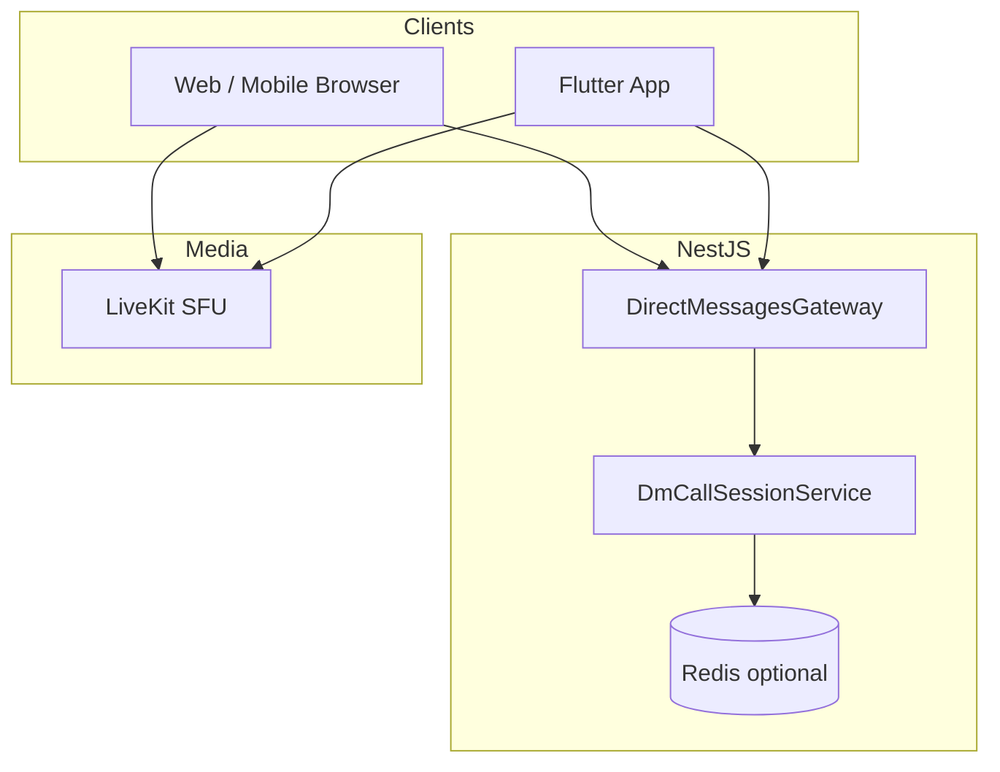
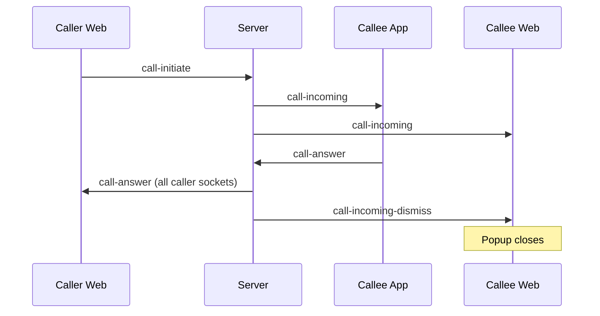

# DM Call — Production Architecture (Audit & Refactor)

## 1. Executive summary

DM voice/video uses **Socket.IO** (`/direct-messages`) for signaling and **LiveKit** for media. Before this refactor, call state lived only in a **process-local `Map`** inside `DirectMessagesGateway`, which caused:

- No **single active call per user** across devices
- No **peer busy** detection
- **Callee multi-device**: accept on web did not dismiss ring on app
- **Caller multi-device**: `call-answer` sent to one socket only
- Ghost rings (no server timeout), duplicate popups, race on simultaneous `call-end`

This document describes the audit, target architecture, and files changed.

---

## 2. Where state lived (before)

| Layer | Location | Lifetime |
|-------|----------|----------|
| Signaling session | `direct-messages.gateway.ts` → `activeCalls` Map | Process RAM |
| Socket routing | `connectedUsers` Map | Process RAM |
| Call history | Mongo `DirectMessage` `type: 'call'` | Persistent |
| Media room | LiveKit `dm-{sortedUserIds}` | LiveKit server |
| Tokens | `POST /calls/create`, `/calls/join`, `/livekit/token` | JWT ~6h |

**Not used for calls:** Redis (only BullMQ jobs), LiveKit webhooks, room delete on DM end.

---

## 3. Architectural defects (root causes)

### 3.1 Single Active Call / Concurrent prevention

- `already_in_call` only checked **same pair**, not “user already in another call”.
- `peer_busy` was defined in types but **never emitted**.
- Callee could receive a second call while already in a call on another device.

### 3.2 Multi-device sync

| Event | Old behavior | Symptom |
|-------|--------------|---------|
| `call-answer` | One initiator socket | Other web tabs / devices miss answer |
| Accept on device A | No event to callee device B | B keeps ringing 45s |
| Reject on device A | `call-rejected` to caller only | B may still show incoming |

### 3.3 Ghost / stale state

- No ring TTL on server (only client 40–45s timers).
- Initiator disconnect cleaned ring; **callee disconnect did not**.
- `call-reject` logged as **`missed`** instead of `declined`.

### 3.4 LiveKit

- DM rooms not deleted (`deleteRoomSafe` unused for `dm-*`).
- `POST /livekit/token` does not verify DM membership (use `/calls/join` on clients).
- Legacy `ice-candidate` / SDP fields still wired but media is LiveKit-only.

### 3.5 Scale-out

- Without Redis + Socket.IO adapter, multiple API instances do not share call state or socket fan-out.

---

## 4. Target architecture

### 4.1 Call State Manager (`DmCallSessionService`)

- **Redis keys** (when `REDIS_URL` set):
  - `user:{userId}` → active `callId`
  - `call:{callId}` → JSON session
  - `lock:user:{userId}` → SET NX + EXPIRE
- **Fallback:** in-memory maps (single instance / dev).
- **States:** `idle | ringing | connecting | connected | reconnecting | disconnected | rejected | cancelled | ended | timeout | failed`
- **Ring TTL:** 90s server timer + Redis EXPIRE
- **Connected TTL:** 6h

### 4.2 Realtime sync events

| Event | Direction | Purpose |
|-------|-----------|---------|
| `call-incoming` | → all callee sockets | Ring |
| `call-incoming-dismiss` | → callee sockets except actor | Close ring on other devices |
| `call-answer` | → **all** caller sockets | Open LiveKit on every caller device |
| `call-rejected` | → all caller sockets | Outgoing rejected |
| `call-ended` | → all peer sockets | End everywhere |
| `call-busy` | → initiator | `already_in_call` \| `peer_busy` \| `user_busy` |
| `call-sessions-sync` | → socket on connect | Reconcile after reconnect |
| `call-heartbeat` | client → server | Extend TTL while in call |

Legacy names kept for compatibility; uppercase aliases can be added as duplicate emits if needed.

### 4.3 Client responsibilities

- **Web:** `lib/dm-call-session-sync.ts`, `use-direct-messages.ts`, `messages/page.tsx`, `GlobalDmIncomingCalls.tsx`
- **Mobile:** `DmCallManager`, `DirectMessagesRealtimeService` — listen `call-incoming-dismiss`, heartbeat with `callId`
- **Tab lock:** `call-tab-coordination.ts` (web outbound per peer) — complements server locks

---

## 5. Sequence — accept on device B (callee)

---

## 6. Files changed (this refactor)

### Backend

| File | Change |
|------|--------|
| `src/dm-call/dm-call.types.ts` | States, types |
| `src/dm-call/dm-call-session.service.ts` | Redis + memory session manager |
| `src/dm-call/dm-call.module.ts` | Global module |
| `src/dm-call/dm-call-session.service.spec.ts` | Unit tests |
| `src/direct-messages/direct-messages.gateway.ts` | Uses session service, multi-socket emit |
| `src/app.module.ts` | Import `DmCallModule` |

### Web

| File | Change |
|------|--------|
| `lib/dm-call-session-sync.ts` | Platform detect, heartbeat helper |
| `hooks/use-direct-messages.ts` | dismiss + sync + `clientPlatform` |
| `app/(main)/messages/page.tsx` | Dismiss + sync handlers |
| `components/GlobalDmIncomingCalls.tsx` | Dismiss handler |

### Mobile

| File | Change |
|------|--------|
| `services/direct_messages_realtime_service.dart` | dismiss stream, heartbeat, platform |
| `call/dm_call_manager.dart` | dismiss listener, heartbeat |

---

## 7. Deployment checklist

1. Set **`REDIS_URL`** on Render/production (required for multi-instance).
2. Configure **Socket.IO Redis adapter** if running >1 API pod (recommended follow-up).
3. Prefer **`POST /calls/join`** over raw `/livekit/token` for DM.
4. Mobile browser: HTTPS, user gesture before `getUserMedia`, test iOS Safari autoplay.

---

## 8. Follow-up (recommended)

- [ ] Socket.IO `@socket.io/redis-adapter` for cross-pod fan-out
- [ ] LiveKit webhook → server `ENDED` + force `call-end`
- [ ] Deprecate `ice-candidate` for DM
- [ ] Integration tests: two sockets same user, accept/reject matrix
- [ ] Metrics: `dm_call_initiate_total`, `dm_call_busy_total`, ring timeout count

---

## 9. Mobile browser notes

- Use `detectDmClientPlatform()` → `mobile_browser` on initiate.
- Request mic/camera after user tap (not on page load).
- iOS: background may suspend socket — rely on `call-sessions-sync` on foreground.
- Android Chrome: verify permission prompts not blocked in WebView.
